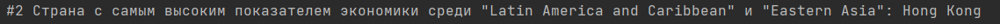

# CountriesProject

*Итоговый проект по курсу Java. Основы программирования на РТФ. Вариант 5*

## Ход работы

1) Провел анализ CSV файла с данными. Разработал класс Country.
2) Распарсил CSV, создал лист из Country.
3) Создал файл бд SQL Lite и подключил ее к проекту. В бд создал таблицы Countries и Regions, чтобы соответствовать 3-ей
   нормальной форме.
4) Написал класс обработчика бд DatabaseHandler для работы с бд. С его помощью все данные из листа сохранил в бд.
5) Реализовал класс Task для решения поставленных задач

# Задание 1:
Дополнительно разбил страны по регионам. Полученные данные для удобства чтения занес в текстовый файл ```countries.txt```


# Задание 2:



# Задание 3:

