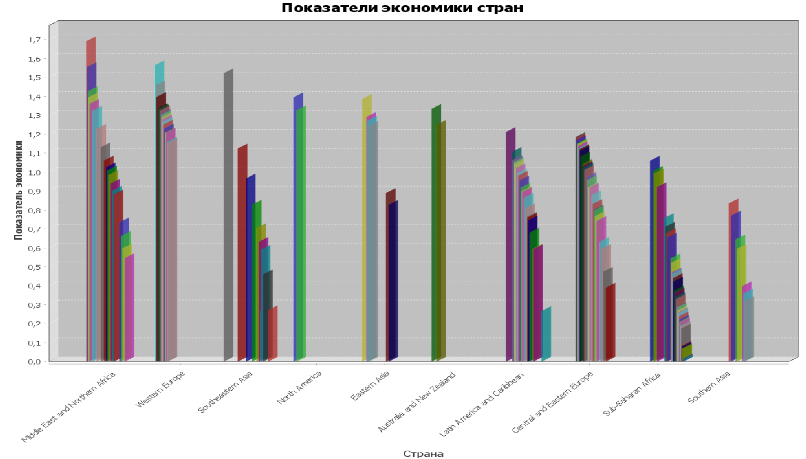

# Итоговый проект
# Вариант 1
## Ход работы
1. Проанализировал CSV файл и разработал классы Parser и Country. Класс Parser считывает данные из файла и преобразует их в соответствующие типы данных. Класс Country хранит полученные данные из класса Parser.
2. Создал файл базы данных SQL Lite и подключил ее к проекту, создал таблицы Countries и Regions, чтобы соответствовать 3-ей НФ.
3. Дополнительно разбил страны по регионам. Полученные данные для удобства чтения занес в текстовый файл ```countries.txt```
4. Написал класс DatabaseHandler для сохранения данных в базу.
5. Создал класс Task для запросов к базе данных и выполнения заданий.

# Задание №1:
Сформируйте график по показателю экономики объеденив их по странам.


# Задание 2:
Выведите в консоль страну с самым высоким показателем экономики среди "Latin America and Caribbean" и "Eastern Asia"


# Задание 3:
Найдите страну с "самыми средними показателями" среди "Western Europe" и "North America"

